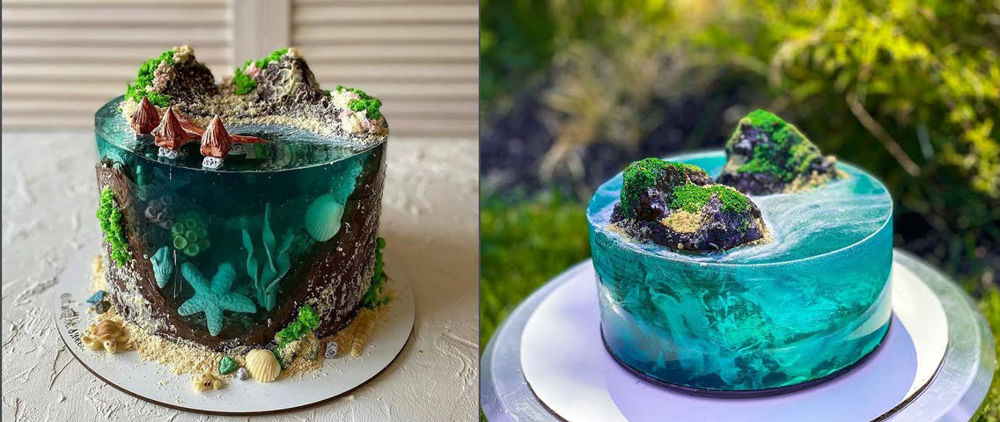

# Ocean Cake

This tropical island-inspired cake has 3 main components:

- Cake island base
- Gelatin ocean, set around the cake base
- Decorations in the form of:
    - Sea life set in the gelatin water
    - sand, rocks, tree's etc.. placed or painted on the cake surface above the water line.
    - foam painted on the water surface.

To make the cake vegetarian, we will use agar agar instead of regular gelatin.

> **Note**: Agar agar metls at a higher temperture than gelatin and becomes more firm. Must be dissolved in boiling liquid to melt (~100 C). You only need a ratio of 2-3% of the liquid's volume of agar agar powder.

## Videos
There are a lot of videos about different styles of this cake, but they all follow the same
main steps, just with different designs.

- [Uses food-safe clay molds and more gelatin for manta rays. Also sets multiple gelatin cells and combines at end.](https://www.youtube.com/watch?v=XHTjl1IR2Bc&ab_channel=GelatinArtMarketStore)

# Design

# Components
## Cake
## Ganache
## Gelatin
## Sand
## Sea Life