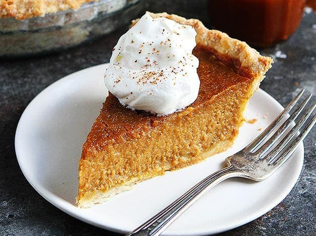
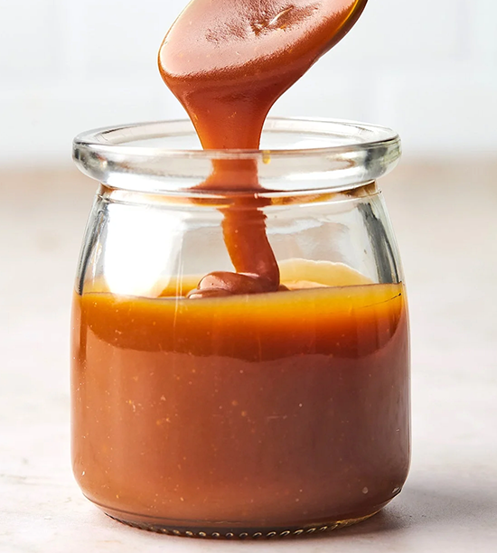

# Fancy Pumpkin Pie

The recipes below are in order of preparation. See [master ingredient list](#master-ingredient-list) at the bottom for shopping.

## Sources
- [13 Pumpkin Pie Upgrades](https://www.realsimple.com/food-recipes/how-to-make-pumpkin-pie-better)
- [Salted Caramel Pumpkin Pie](https://www.twopeasandtheirpod.com/salted-caramel-pumpkin-pie/)
- [Salted Caramel Sauce](https://www.twopeasandtheirpod.com/salted-caramel-sauce/)
- [Pie Crust Video](https://youtu.be/FC87gs1V-Gc)

## Recipes

### Pie Crust
This makes enough dough for 2 pies, or one pie with a cover. If you make the full recipe, cut the dough in half to roll out crust and use
the rest for decoration. I used the other half the make a braid that I attached to the rim of the pie crust that looks nice (egg wash it when baked)
along with some leaves I made with a glass as a cookie cutter and a knife to cut veins in leaves, to place on top of the pie. Bake those when you
blind-bake the crust and save them to top the pie later.

#### Ingredients
- 3 cups all purpose flour
- 8 oz butter
- 1 cup ice cold water
- 1 tablespoon sugar
- 1 teaspoon salt

#### Instructions
- All ingredients should be COLD (even flour if you can)
- cut butter into small cubes
- mix all ingredients except water in stand mixer for 1-2 minutes on low speed (should still have chunks of butter)
- mix in most of the water - add the rest as needed for a lumpy shaggy dough - mix only until water is just incorperated - DO NOT OVER MIX
- dump onto floured surface and press dough together flat. Fold on itself, press flat and repeat a couple times
    - Should end up fairly loose and not smooth with globs of butter still
- Wrap in plastic wrap and refridgerate for 1 hour
- flour & roll out

### Salted Caramel Sauce

#### Ingredients
- 1 cup sugar
- 6 tablespoons (3/8 cup) butter
- 1/2 cup heavy cream
- 1 teaspoons sea salt

#### Instructions
- melt sugar over medium-high heat - whisking constantly once it starts to melt
- cook sugar until it is a deep amber color - careful not to burn
- add butter - stir until combined
- remove from heat and slowly add cream until combined
- whisk in salt and let cool before storing for up to a month

### Pie
#### FIlling Ingredients
- 15 ounces punpkin puree
- 1 cup packed light brown sugar
- 3 eggs
- 1/2 teaspoon salt
- 2.5 teaspoon cinnamon
- 1 teaspoon ground ginger
- 1/2 teaspoon nutmeg
- 1/2 teaspoon cloves
- 1 teaspoon vanilla extract
- 1 1/4 cup heavy cream
- 1/2 cup [salted caramel sauce](#salted-caramel-sauce)
- ginger snaps & pecans for crust lining

#### Instructions
##### Blink Bake Crust
- Roll out dough, fit to pie pan and put in freezer for 20-30 minutes
- preheat oven to 375f
- spread thin layer of crushed ginger snaps & pecans on bottom of pie
- line pie dough with parchment paper or aluminum and fill with pie weights (beans or rice)
- bake for 20 minutes
- let cool for 5 minutes, then remove weights

##### Filling & Finish
- whisk together all ingredients, adding cream last before the caramel sauce until smooth
- bake for 45-55 minutes, until center is almost set, but still a little jiggly
    - **Core Temp:** 185f
- turn off the oven and let pie cool in oven with door slightly open (prevents cracking)

### Rum Whipped Cream
#### Ingredients
- 1 cup heavy whipping cream
- 3 tablespoons sugar
- 1/2 teaspoon vanilla extract
- 1 tablespoon dark rum

#### Instructions
- **Optional:** chill whipping bowl
- whip cream until it starts to thicken
- add remaining ingredients
- whip until stiff peaks

## Master Ingredient List
- butter 14 tablespoons (7/8 cup)
- eggs 3
- heavy cream 2 3/4 cup
- flour 1 1/2 cups
- salt 2 teaspoon
- sugar 1 1/4 cups
- light brown sugar 1 cup
- cinnamon 2.5 teaspoon
- cloves 1/2 teaspoon
- nutmeg 1/2 teaspoon
- ginger 1 teaspoon
- vanilla extract 1 1/2 teaspoon
- punpkin puree 15 ounces
- dark rum 1 tablespoon 
- ginger snaps & pecans for crust lining