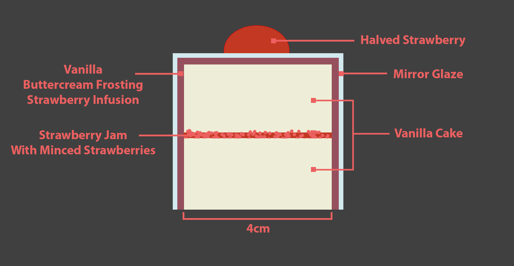
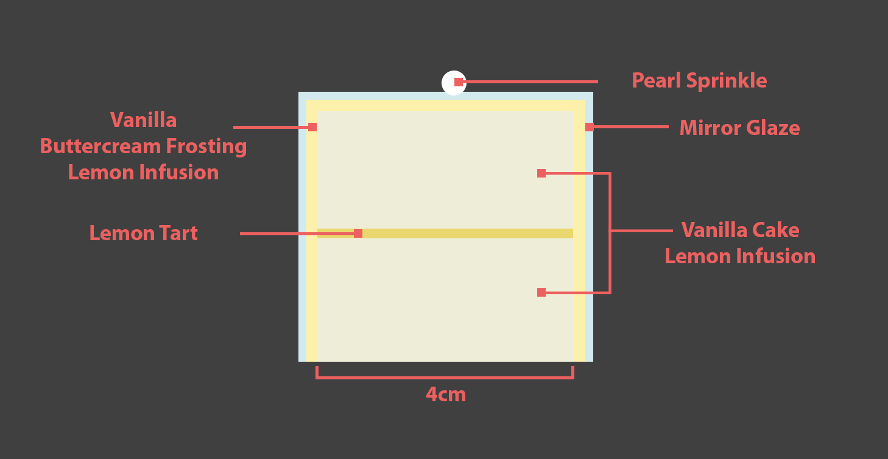
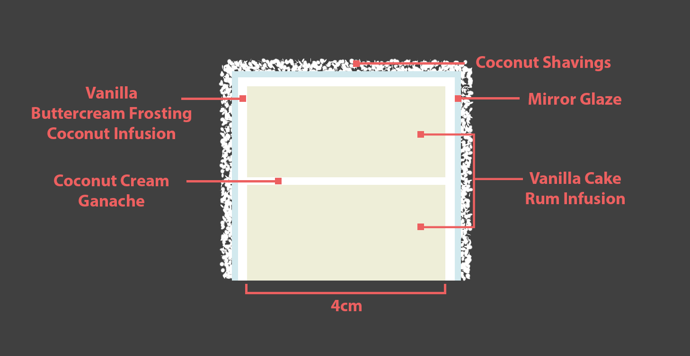
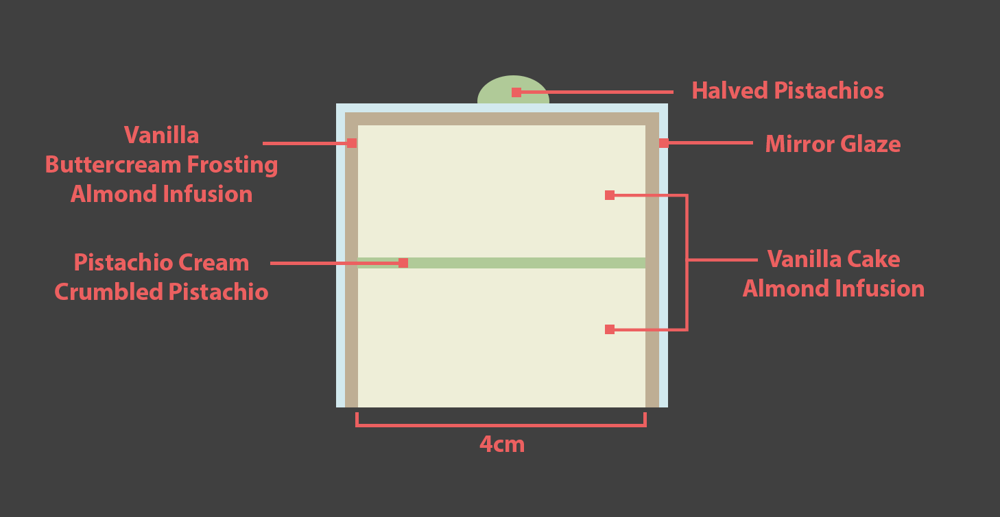
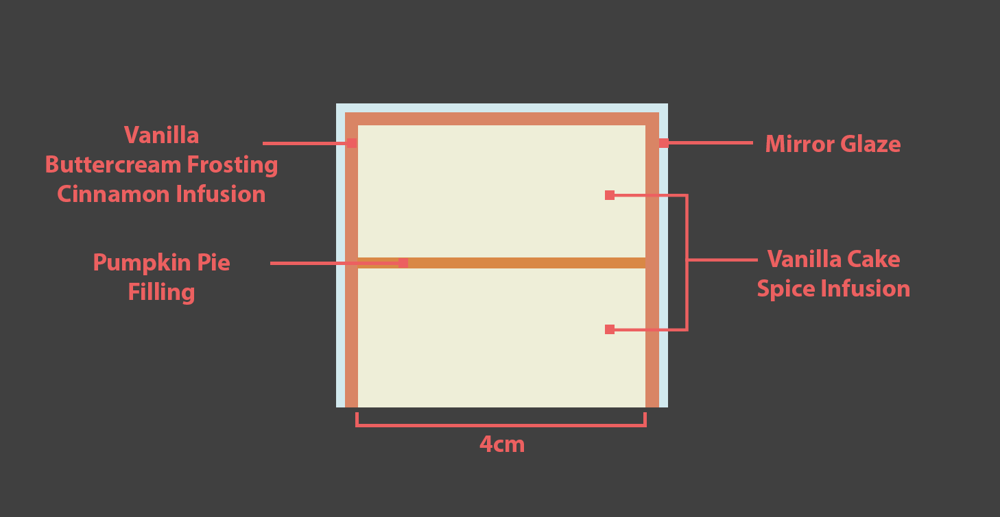

# Rubiks Cube Cake

There are quite a lot of pcitures of rubiks cube cakes that folks have done online - but this is by far the most attractive.
We don't have an exact recipe for this cake, so we're going to make our own by cobbling together what we can find and invent.

[An article with a little info on the target cake](https://mymodernmet.com/cedric-grolet-rubiks-cube-cakes/)

[This is one example how-to](https://www.youtube.com/watch?v=qpEO6RWzMJ8&t=738s&ab_channel=HowToCookThat)

[Instructions for video](https://www.howtocookthat.net/public_html/rubiks-cube-cake/)

# Design
 The cake is comprised of 25-27 individual cubed cakes, stacked on chocolate platforms - potentially with chocolate pillars supported by a rod to enable horizontal rotation of each layer.

 ## Cake Flavors

 ### Chocolate Nutella (Brown)
 

 ### Strawberry Shortcake (Burgundy)
 

 ### Lemon (Yellow)
 

 ### Coconut (Light-Brown)
 

 ### Pistachio (Greenish-Brown)
 

 ### Pumpkin Spice (Orange)
 

## Layout

## Master Ingredient List

# Component Recipes

## Cake

## Glaze
[Tutorial](https://www.youtube.com/watch?v=qMFzoUbw9pg&ab_channel=emmymade)

# Schedule

## Day 1
- bake cake
- cool cake
- cut & fit cake into tupperwares
- make syrups
- make fillings
- fill cakes in tupperwares
- freeze tupperwares
- temper chocolate
- fill & freeze chocolate mold.

## Day 2
- Remove cakes from tupperwares
- cut & trim cakes to size
- frost cakes
- freeze cakes
- temper chocolate
- fill & freeze chocolate mold and pillars
- make mirror glaze
- remove cakes from freezer
- apply mirror glaze to cakes
- let cool
- Decorate cubes
- assemble final cake