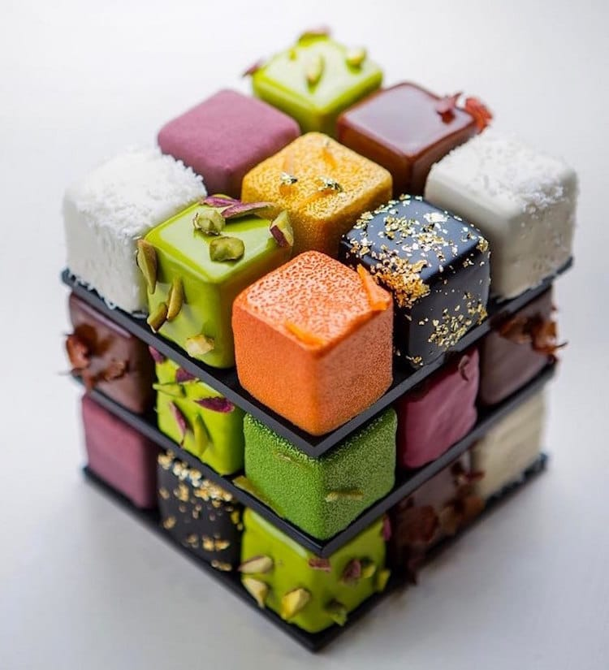
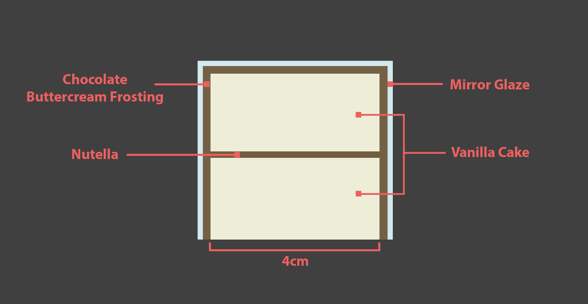

# Rubiks Cube Cake

There are quite a lot of pcitures of rubiks cube cakes that folks have done online - but this is by far the most attractive.
We don't have an exact recipe for this cake, so we're going to make our own by cobbling together what we can find and invent.

[An article with a little info on the target cake](https://mymodernmet.com/cedric-grolet-rubiks-cube-cakes/)

[This is one example how-to](https://www.youtube.com/watch?v=qpEO6RWzMJ8&t=738s&ab_channel=HowToCookThat)

[Instructions for video](https://www.howtocookthat.net/public_html/rubiks-cube-cake/)

# Design
The cake is comprised of 25-27 individual cubed cakes, stacked on chocolate platforms - potentially with chocolate pillars supported by a rod to enable horizontal rotation of each layer.

## Cake Flavors

### Chocolate Nutella (Brown)

- 1 Jar of nutella
- chocolate buttercream frosting

### Strawberry Shortcake (Burgundy)

- strawberries
- strawberry jam
- whipped cream

### Lemon (Yellow)

- lemon
- 1/4 cup sugar

#### Lemon Tart Filling
[Source Video](https://www.youtube.com/watch?v=enFLdmXUdUk&ab_channel=Jasmin%27sChannel)

#### Ingredients
- 2 eggs
- 66 grams butter
- 73 grams sugar
- 1.5 lemons

#### Instructions
- zest the lemons
- juice the lemons
- combine lemon zest, juice and sugar
- bring to a boil
- beat eggs
- add lemon mixture to eggs a little at a time while mixing, to prevent eggs from cooking
- pour back into pan and let it cook for 10 minutes, add the butter to the mixture
- strain the curd

### Coconut (Light-Brown)

 
- coconut shavings
- heavy cream
- rum

### Pistachio (Greenish-Brown)

- almond extract
- pistachios
- whipped cream

### Pumpkin Spice (Orange)

- cinnomon
- nutmeg
- cloves
- pumpkin pie filling or pumpkin pureee and condensed milk

## Layout

## Master Ingredient List

- 26 oz cake flour
- sugar
- 6 tsp (28g) baking powder
- 1/2 tsp baking soda
- 1 tsp salt
- 16 oz (454g) butter
- 2 tbsp vanilla extract
- 20 oz (566g) whole milk
- 6 oz (170g) vegetable oil
- 8 large eggs
- 66 grams butter
- 2 lemons
- 1 Jar of nutella
- chocolate buttercream frosting
- strawberries
- strawberry jam
- whipped cream
- coconut shavings
- heavy cream
- rum
- almond extract
- pistachios
- cinnomon
- nutmeg
- cloves
- pumpkin pie filling or pumpkin pureee
- 4 tablespoon unflavored gelatin powder (4 envelopes) + 1/2 cup water
- 4 cup white chocolate chips
- 2 bags semi-sweet dark chocolate
- 2 cups condensed milk

# Component Recipes

## Vanilla Cake
[Source video](https://www.youtube.com/watch?v=5gB8nKbJ0jc&ab_channel=SugarGeekShow)
Light, fluffy vanilla cake

### Ingredients
- 26 oz cake flour
- 26 oz sugar
- 6 tsp (28g) baking powder
- 1/2 tsp baking soda
- 1 tsp salt
- 16 oz (454g) butter
- 2 tbsp vanilla extract
- 20 oz (566g) whole milk
- 6 oz (170g) vegetable oil
- 6 large eggs

### Instructions
- Make all ingredients room temprature
- preheat oven to 335 degrees
- combine half the milk with eggs & vanilla
- combine half the milk with oil
- combine flour, sugar, salt, baking powder & baking soda in stand mixer
- add butter to stand mixer small chunks at a time
- add milk & oil mixture to mixer all at once and mix for 2 minutes
- add remaining liquid in thirds until well combined
- bake for 25-30 minutes, until toothpick comes out clean. Bake for 3 minute increments if need more time

## Glaze
[Tutorial](https://www.youtube.com/watch?v=qMFzoUbw9pg&ab_channel=emmymade)

### Ingredients
- 2 cup water
- 4 tablespoon unflavored gelatin powder (4 envelopes) + 1/2 cup water
- 4 cup white chocolate chips
- 1 cup sugar
- 1.5 cups condensed milk

### Instructions
- bloom gelatin with half of the water
- to a pan add condensed milk, sugar, the rest of the water, vanilla and bring to a simmer
- remove from heat
- add gelatin
- strain mixture into bowl with chocolate
- let sit for a few minutes
- combine the mixture (stir)
- strain the mixture **at 90 degrees farenheit**
- mix food coloring

# Schedule

## Day 1
- bake cake
- cool cake
- cut & fit cake into tupperwares
- make syrups
- make fillings
- fill cakes in tupperwares
- freeze tupperwares
- temper chocolate
- fill & freeze chocolate mold.

## Day 2
- Remove cakes from tupperwares
- cut & trim cakes to size
- frost cakes
- freeze cakes
- temper chocolate
- fill & freeze chocolate mold and pillars
- make mirror glaze
- remove cakes from freezer
- apply mirror glaze to cakes
- let cool
- Decorate cubes
- assemble final cake