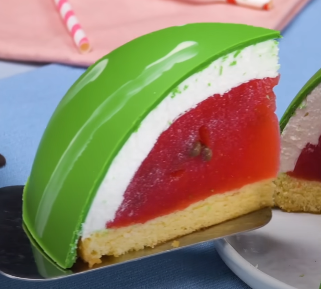

# Watermellon Cake

[Source video](https://www.youtube.com/watch?v=oDsZL-libVc&ab_channel=Scrumdiddlyumptious)
Light, fluffy & refreshing watermellon cake!

## Vanilla Cake
### Ingredients
- 13 oz cake flour
- 13 oz sugar
- 3 tsp (14g) baking powder
- 1/4 tsp baking soda
- 1/2 tsp salt
- 8 oz (227g) butter
- 1 tbsp vanilla extract
- 10 oz (283g) whole milk
- 3 oz (85g) vegetable oil
- 3 large eggs
- vanilla bean or extract

### Instructions
- Make all ingredients room temprature
- preheat oven to 335 degrees
- combine half the milk with eggs & vanilla
- combine half the milk with oil
- combine flour, sugar, salt, baking powder & baking soda in stand mixer
- add butter to stand mixer small chunks at a time
- add milk & oil mixture to mixer all at once and mix for 2 minutes
- add remaining liquid in thirds until well combined
- bake for 25-30 minutes, until toothpick comes out clean. Bake for 3 minute increments if need more time

## Watermellon Filling
### Ingredients
- 1/4 watermellon
- 2 oz water
- 2 oz sugar
- 12 sheets of gelatin
- 12 oz white chocolate
- green food coloring
- 8 oz whipped cream

### Instructions
- blend watermellon
- mix water, suagar, gelatin & watermellon in pan bring to simmer & combine
- pour mixture into baking pan, add chocolate chips
- brush inside of silicon mold with white chocolate
- mix white chocolate with food coloring
- pour white chocolate into silicon mold and coat the outside - then refridgerate
- coat inside of chocolate shell with whipped cream
- pour watermellon mixture into shell
- put cake bottom ontop of shell, flip the shell with a plate underneath and refridgerate
