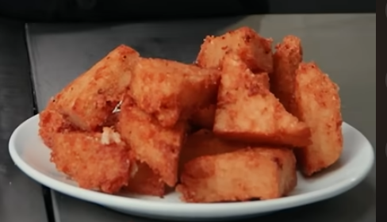

# Rosti

[Video Link](https://www.youtube.com/shorts/EswFR-oEC_w)

## Ingredients
- 5 russet potato's
- 3 small onions
- onion powder
- corn starch
- salt
- white pepper

## Instructions
- preheat oven to 200
- Make a cartouche for pot to confi in
- grate potato
- wash starch off potato (2 rounds through water)
- strain moisture out of potato by squeezing in dish towel
- blend onion with a tiny bit of water
- strain moisture out of onion by squeezing in dish towel
- combine onion & potato
- melt butter in a separate pot
- sweat mixture briefly to remove remaining moisture
- add butter to mixture, place cartouch on top and put in oven to confi for ~45 minutes
- remove from oven and let cool for ~15 minutes
- a little at a time, strain fat mixture in seive, pressing only gently (don't mash the potato)
- add powder mixture and combine
- press mixture into container with parchment on top, ideally compressed firmly.
- put in fridge for at least 4 hours
- cut into triangles and deep fry at 350f or air fry at 400 for ~15-20 minutes
    - **Note:** Cook it longer than you'd expect. It can survive longer in the heat because we removed a lot of the starch.
